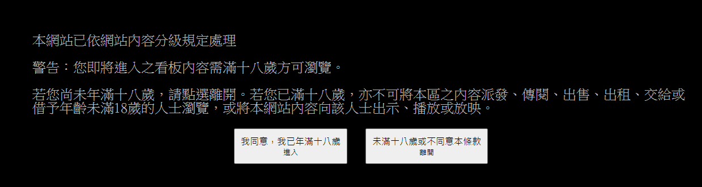

## 📣 Web-Clawer Development  - Gossiping Edition（PTT）


### 🎓 What is a web crawler？

**It is a program that can automatically crawl web content.**

**I believe that everyone has encountered the need to crawl web information, perhaps because they want to make a report, or want to do research out of interest, and need relevant reference materials. The simplest method is to copy it one by one, then paste it into excel or a text editor to save it, and then do subsequent analysis.**


**If there are only a few dozen transactions, that's okay, but what if there are hundreds or thousands of transactions?**


**Repeat the action several times, and you can roughly break down each step: first enter a certain page, copy the required field information, paste it into the text editor, and then continue to loop until all pages have been flipped. That’s it, you’re done.**


### 📋 Python crawls PTT Gossiping Edition article titles


&nbsp; 


#### 🎓 Create a Request object and attach Request Headers information


**After executing the program, although the webpage can be crawled normally, you will find that the captured content is different from the actual content. The text "You must be 18 years or older to view the board content" appears.**


```

import urllib.request as req 

URL = "https://www.ptt.cc/bbs/Gossiping/index.html"

# 建立一個 Request 物件，附加 Request Headers 的資訊
request = req.Request(URL, headers={
    "cookie":"over18=1",
    "user-agent": "Mozilla/5.0 (Windows NT 10.0; Win64; x64) AppleWebKit/537.36 (KHTML, like Gecko) Chrome/88.0.4324.190 Safari/537.36"
})

with req.urlopen(request) as responce:
    data = responce.read().decode("utf-8")

print(data)

```

#### ➤ Result

&nbsp; 

___


**Cookies refer to data stored in the user's browser by some websites in order to identify the user. Cookies can record information when the user browses. When the user accesses another page, the browser will send the Cookies to the server. , letting the server know the user's current status.**


#### ➤ Result

&nbsp; 

___


**After opening it, click the "Application" tab, select Cookies > https://www.ptt.cc on the left, and you can see which PTT website cookies are recorded by the browser.**


https://github.com/LazyDelon/Web-Crawler-Dev-Projects/assets/153699726/3aa0a205-40cc-4c26-9dbe-8b7ebfb41210


#### 🎓 Add Cookies Information

```

import urllib.request as req 

URL = "https://www.ptt.cc/bbs/Gossiping/index.html"

# 建立一個 Request 物件，附加 Request Headers 的資訊
request = req.Request(URL, headers={
    "cookie":"over18=1",
    "user-agent": "Mozilla/5.0 (Windows NT 10.0; Win64; x64) AppleWebKit/537.36 (KHTML, like Gecko) Chrome/88.0.4324.190 Safari/537.36"
})

with req.urlopen(request) as responce:
    data = responce.read().decode("utf-8")

print(data)

```

#### ➤ Result

&nbsp; 

___


#### 🎓 Use BeautifulSoup to get specific content

**After obtaining the web page content, you can use the Beautiful Soup library to filter out specific content. After the code below is executed, the title of the article and the URL of the hyperlink will be obtained**.


```

# 透過 追蹤網路的超連結 抓取 下一個網頁的資訊 - 連續抓取頁面實務

# 抓取 PTT 八卦版 的 網頁原始碼[HTML]
import urllib.request as req 


URL = "https://www.ptt.cc/bbs/Gossiping/index.html"


# 建立一個 Request 物件，附加 Request Headers 的資訊
request = req.Request(URL, headers={
    "cookie":"over18=1",
    "user-agent": "Mozilla/5.0 (Windows NT 10.0; Win64; x64) AppleWebKit/537.36 (KHTML, like Gecko) Chrome/88.0.4324.190 Safari/537.36"
})

with req.urlopen(request) as responce:
    data = responce.read().decode("utf-8")
    
# 解析原始碼，取得每篇文章標題
import bs4

root = bs4.BeautifulSoup(data, "html.parser")

# 尋找所有 class="title"的 div 標籤
titles = root.find_all("div", class_="title")

for title in titles:
    if title.a != None:
        print(title.a.string)
        print("https://www.ptt.cc" + title.a.get("href"))

```

#### ➤ Result

&nbsp; 

___


#### 🎓 Capture the information of the next web page by tracking hyperlinks on the Internet - Continuous page crawling practice**


```

# 透過 追蹤網路的超連結 抓取 下一個網頁的資訊 - 連續抓取頁面實務

# 抓取 PTT 八卦版 的 網頁原始碼[HTML]
import urllib.request as req 

def getData(URL):

    # 建立一個 Request 物件，附加 Request Headers 的資訊
    request = req.Request(URL, headers={
        "cookie":"over18=1",
        "user-agent": "Mozilla/5.0 (Windows NT 10.0; Win64; x64) AppleWebKit/537.36 (KHTML, like Gecko) Chrome/88.0.4324.190 Safari/537.36"
    })
    
    with req.urlopen(request) as responce:
        data = responce.read().decode("utf-8")
        
    # 解析原始碼，取得每篇文章標題
    import bs4
    
    root = bs4.BeautifulSoup(data, "html.parser")
    
    # 尋找所有 class="title"的 div 標籤
    titles = root.find_all("div", class_="title")
    
    # 如果標題包含 a 標籤〔沒有則刪除〕，印出來
    for title in titles:
        if title.a != None:
            print(title.a.string)
            print("https://www.ptt.cc" + title.a.get("href"))
            
    # 利用 a 標籤 裡面的文字，來抓取 超連結 網址
    NextLink = root.find("a", string="‹ 上頁")
    return NextLink["href"]

    # 確認網址是否完整 - 相對網址
    # print(NextLink["href"])
            
PageURL = "https://www.ptt.cc/bbs/Gossiping/index.html"

count = 0
print("\n")
print("---------------")

while count < 5:
    PageURL = "https://www.ptt.cc" + getData(PageURL)
    count = count + 1
    
    print("---------------")

```

#### ➤ Result

&nbsp; 

___
